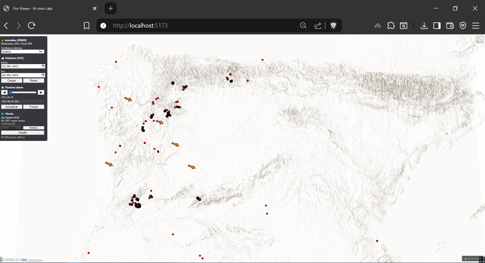

# 🔥 Fire Viewer

**Un visualizador en tiempo real de incendios forestales desarrollado por ⚠️ IA-ismo Labs**

## 📋 Descripción

Fire Viewer es una aplicación web que permite visualizar datos de incendios forestales en tiempo real utilizando datos de NASA FIRMS (Fire Information for Resource Management System) en un mapa interactivo powered by Cesium.

## 📸 Vista previa



*Visualización en tiempo real de incendios forestales con datos de viento y timeline interactivo*

### ✨ Características principales

- 🗺️ **Visualización interactiva** con datos de incendios en tiempo real
- 📊 **Timeline interactivo** para navegar entre días históricos
- 🌬️ **Datos meteorológicos** con visualización de viento (velocidad y dirección)
- 🎯 **Filtros avanzados** por confianza, sensor y rango temporal
- 📱 **Interfaz responsive** y fácil de usar
- 🔄 **Actualización automática** de datos desde NASA FIRMS

## 🛠️ Tecnologías utilizadas

- **Backend**: Python FastAPI + Uvicorn
- **Frontend**: HTML5 + JavaScript + Cesium Maps
- **APIs**: NASA FIRMS + OpenMeteo Weather API
- **Datos**: GeoJSON + SQLite cache

## 📦 Instalación

### Prerrequisitos

- Python 3.11 o superior
- Navegador web moderno (Chrome, Firefox, Edge)
- Conexión a internet

### 1. Clonar el repositorio

```bash
git clone https://github.com/IA-ismo-Lab/fire-viewer.git
cd fire-viewer
```

### 2. Crear entorno virtual

```bash
python -m venv .venv
```

**Windows:**
```batch
.venv\Scripts\activate
```

**Linux/macOS:**
```bash
source .venv/bin/activate
```

### 3. Instalar dependencias

```bash
pip install -r backend/requirements.txt
```

### 4. Configurar APIs

Copia el archivo de ejemplo y configura tus APIs:

```bash
cp .env.example .env
```

Edita el archivo `.env` con tus claves:

```env
FIRMS_MAP_KEY=tu_clave_nasa_firms_aqui
BOUNDING_BOX=-8.95,41.45,-5.70,43.10
```

#### 🔑 Obtener claves de API

**NASA FIRMS MAP KEY** (Requerido):
1. Ve a https://firms.modaps.eosdis.nasa.gov/api/
2. Registra una cuenta gratuita
3. Solicita una MAP KEY para el área de datos
4. Copia la clave en `FIRMS_MAP_KEY`

**Cesium Token** (Requerido):
1. Ve a https://cesium.com/ion/signup/
2. Crea una cuenta gratuita
3. En tu dashboard, copia tu "Default Access Token"
4. Edita `frontend/index.html` y reemplaza `YOUR_CESIUM_TOKEN_HERE` con tu token

### 5. Configurar área geográfica

En el archivo `.env`, ajusta el `BOUNDING_BOX` para tu región de interés:

```env
# Formato: lon_min,lat_min,lon_max,lat_max
BOUNDING_BOX=-8.95,41.45,-5.70,43.10  # Galicia, España (ejemplo)
```

Ejemplos de otras regiones:
- **Península Ibérica**: `-10,35.5,4.5,44.5`
- **California**: `-125,32,-114,42`
- **Australia Este**: `140,-40,155,-25`

## 🚀 Uso

### Iniciar la aplicación

**Método 1: Scripts automáticos (Windows)**
```batch
# Terminal 1 - Backend
start_backend.bat

# Terminal 2 - Frontend  
start_frontend.bat
```

**Método 2: Manual**
```bash
# Terminal 1 - Backend
uvicorn backend.app.main:app --reload --port 8089

# Terminal 2 - Frontend (Windows)
cd frontend && python -m http.server 8080

# Terminal 2 - Frontend (Linux/macOS)  
cd frontend && python3 -m http.server 8080
```

### Acceder a la aplicación

- **Frontend**: http://localhost:8080
- **API Backend**: http://localhost:8089
- **API Docs**: http://localhost:8089/docs

## 🎮 Características de la interfaz

### Panel de control

- **Filtros de confianza**: Filtra incendios por nivel de confianza (l/n/h)
- **Histórico**: Carga datos de hasta 7 días anteriores  
- **Timeline**: Navega entre días con controles prev/next
- **Información de viento**: Velocidad, dirección y visualización con flechas
- **Estadísticas**: Contadores en tiempo real

### Controles del mapa

- **Ratón izquierdo**: Mover mapa
- **Ratón derecho**: Rotar vista  
- **Rueda**: Zoom in/out
- **Click en incendio**: Ver detalles (sensor, confianza, FRP, etc.)

## 🔧 Personalización

### Cambiar región geográfica

Modifica `BOUNDING_BOX` en `.env` con las coordenadas de tu área de interés.

### Ajustar frecuencia de actualización

```env
FETCH_INTERVAL_MIN=15  # Minutos entre actualizaciones
MAX_HOURS_DEFAULT=24   # Horas de retención por defecto
```

### Cambiar dataset FIRMS

```env
FIRMS_DATASET=VIIRS_SNPP_NRT  # VIIRS Suomi NPP (recomendado)
# FIRMS_DATASET=MODIS_NRT     # MODIS Aqua/Terra  
# FIRMS_DATASET=LANDSAT_NRT   # Landsat 8/9
```

## 📁 Estructura del proyecto

```
fire-viewer/
├── backend/
│   ├── app/
│   │   ├── main.py          # API FastAPI principal
│   │   ├── config.py        # Configuración
│   │   ├── fetcher.py       # Cliente NASA FIRMS
│   │   ├── models.py        # Modelos de datos
│   │   └── weather.py       # Cliente OpenMeteo
│   └── requirements.txt     # Dependencias Python
├── frontend/
│   ├── index.html          # Interfaz principal
│   └── app.js              # Lógica JavaScript + Cesium
├── .env.example            # Plantilla configuración
├── .gitignore             # Archivos ignorados
├── start_backend.bat      # Script inicio backend (Windows)
├── start_frontend.bat     # Script inicio frontend (Windows)  
└── README.md              # Este archivo
```

## 🤝 Contribuir

¡Las contribuciones son bienvenidas! Por favor:

1. Fork el proyecto
2. Crea una rama para tu feature (`git checkout -b feature/nueva-funcionalidad`)
3. Commit tus cambios (`git commit -am 'Añadir nueva funcionalidad'`)
4. Push a la rama (`git push origin feature/nueva-funcionalidad`)
5. Abre un Pull Request

## 📄 Licencia

MIT License - ver [LICENSE](LICENSE) para detalles.

**Uso permitido:**
- ✅ Uso personal y educativo
- ✅ Fork y modificación
- ✅ Uso en investigación
- ❌ Uso comercial sin autorización

## 🙏 Créditos

- **Datos de incendios**: [NASA FIRMS](https://firms.modaps.eosdis.nasa.gov/)
- **Datos meteorológicos**: [OpenMeteo](https://open-meteo.com/)
- **Visualización**: [Cesium](https://cesium.com/)
- **Desarrollado por**: ⚠️ [IA-ismo Labs](https://github.com/IA-ismo-Lab)

## ⚡ Solución de problemas

### Error "MAP_KEY vacío"
- Verifica que `FIRMS_MAP_KEY` esté configurado en `.env`
- Solicita una nueva clave en https://firms.modaps.eosdis.nasa.gov/api/

### Error "Token Cesium inválido"  
- Verifica tu token en `frontend/index.html`
- Genera un nuevo token en https://cesium.com/ion/

### No se muestran incendios
- Verifica que el `BOUNDING_BOX` cubra tu región de interés
- Confirma que hay incendios activos en la zona y período seleccionados

### Puerto ocupado
- Cambia los puertos en los scripts de inicio si 8080/8089 están en uso

---

**Desarrollado por ⚠️ IA-ismo Labs**

## 🤖 Créditos de desarrollo

**Desarrollado por:**
- **Claude Sonnet 4** - Asistente de IA para desarrollo
- **GPT-5** - Asistente de IA para desarrollo  
- **⚠️ IA-ismo Labs** - [Alicia Colmenero Fernández](https://github.com/alixiacf)

**Síguenos:**
- 📰 **Newsletter**: [IA-ismo](https://www.linkedin.com/newsletters/ia-ismo-7013065703138177024/)
- 💻 **GitHub**: [@alixiacf](https://github.com/alixiacf)
- 🏢 **Organización**: [IA-ismo-Lab](https://github.com/IA-ismo-Lab)
